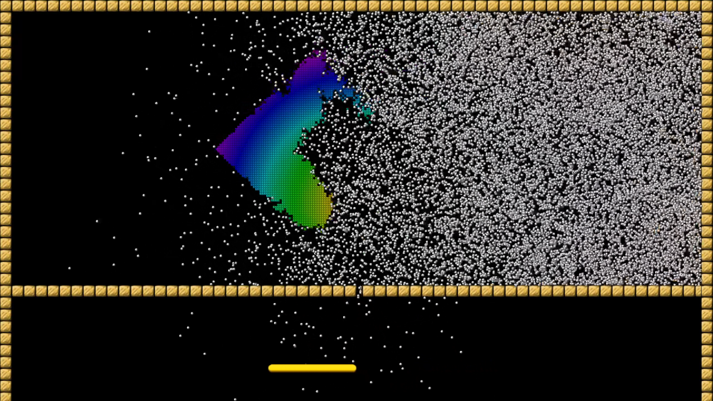

# gml-breakout

Implementation of a very fast breakout game, which can easily have tens of thousands of balls at once, with decent fps.

A couple of things that I learned along the way:
1. It's faster to pool instances, meaning when your instance should be destroyed, deactivate it and insert into some data structure for later retrieving.
2. The top scenario can be even faster if instead of deactivating it, you move it far away and stop updating it. The number of activations/deactivations is reduced to practically 0 and a check at the top of the step event is used to skip it.
3. Most built-in collision functions/events are slow, avoid them if possible. For this project I know where obstacles are and can cache them in a grid data structure. Grid is very fast with filling a region with some values, tried 2D array and it's way too slow. 
4. Most advanced movement functions like move_bounce_solid really don't play well with custom collision systems, since it calculates collision in the way GM wants to. Also it's slower than a custom implementation for this project.
5. Use your own implementation for functions that GM offers if you're compiling with YYC, for example point_in_rectangle is slower than if you implement it where you need it, or point_distance is slower than you implementing a non-sqrt version (x*x+y*y).

